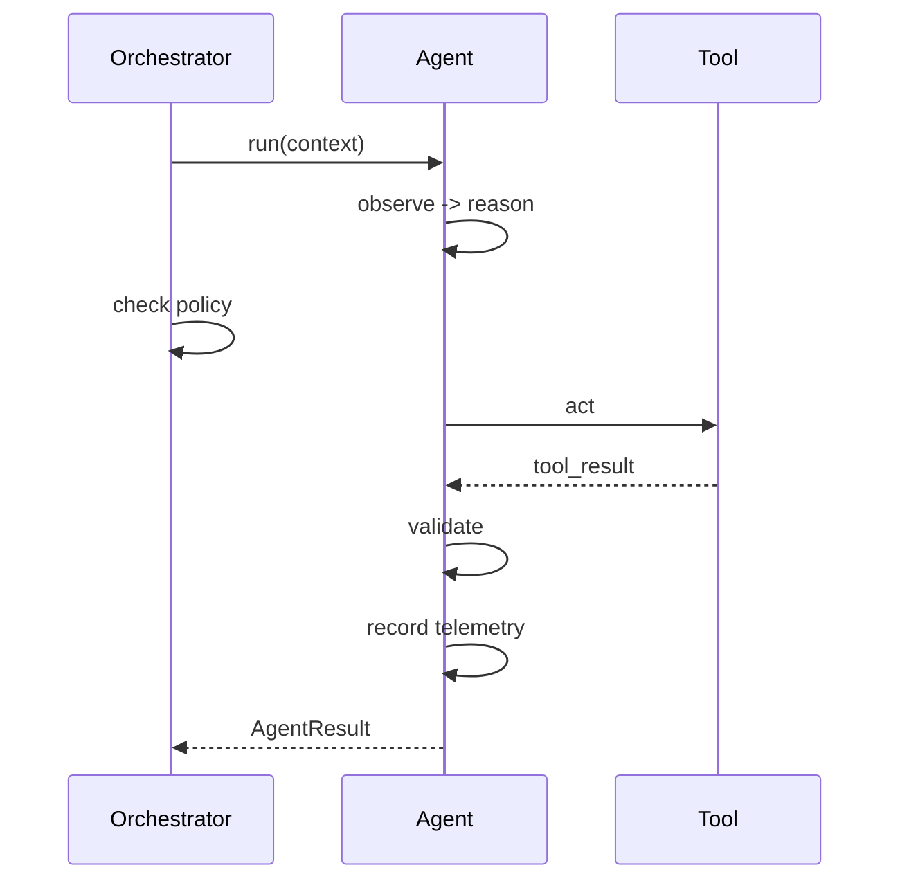

# evolutionary-cicd

### Conference talk: *"Evolutionary CI/CD: Building Intelligent Delivery Pipelines with AI Agents"*

> Traditional CI/CD executes workflows.
> Agentic CI/CD reasons inside workflows.
> Evolutionary CI/CD improves the workflows themselves.

This repository is a reference implementation for a conference demo showing
the progression from traditional CI/CD, to AI-assisted CI/CD, to agentic
CI/CD, and finally to **evolutionary CI/CD**: a system where AI agents
observe pipeline history and recommend improvements to the delivery pipeline
itself — always gated by explicit policy and human approval.

> **Disclaimer:** This is an educational / conference reference
> implementation, not a production-grade platform. It intentionally favors
> readability and live-demo reliability over enterprise scale.

## Problem statement

CI/CD pipelines execute the same deterministic steps forever, even when they
are flaky, slow, or repeatedly failing for a known reason. This project asks:
what if a pipeline could reason about its own test quality, its own supply
chain risk, its own merge conflicts — and, over time, about its own
history — while GitHub Actions remains firmly in control of execution?

## Maturity model

| Stage | Behavior |
|---|---|
| **Traditional CI/CD** | Executes workflows: lint, test, build, deploy. |
| **AI-assisted CI/CD** | Explains workflow output: summarizes failures, coverage gaps. |
| **Agentic CI/CD** | Reasons and performs *bounded* actions inside workflows: proposes tests, resolves conflicts, validates its own output. |
| **Evolutionary CI/CD** | Learns from historical pipeline telemetry and recommends changes to the workflows themselves — always requiring human approval. |

## Architecture overview

See [`docs/architecture.md`](docs/architecture.md) for the full diagram and
explanation. In short:


Every agent follows the same lifecycle:



## Repository structure

```
app/            demo payment/order application (business logic under test)
agents/         BaseAgent + one module per specialized agent + orchestrator
tools/          the only things agents may invoke: GitHub API, git, pytest, scanners
llm/            provider-neutral, OpenAI-compatible LLM client
prompts/        system prompts for each agent (untrusted-input rules included)
policies/       agent_permissions.yml (capability) + approval_rules.yml (authority)
telemetry/      structured logging + append-only telemetry store
scripts/        run_agent.py, collect_pipeline_context.py, seed_demo_history.py
data/           seeded pipeline history + local telemetry (gitignored at runtime)
docs/           architecture, agent model, security model, demo scenario
.github/        GitHub Actions workflows + issue/PR templates
```

## Agents

| Agent | What it does | Can modify code? | Can merge/deploy? |
|---|---|---|---|
| `test_quality_agent` | Flags under-tested diff branches; can generate & run candidate tests | Yes (requires approval) | No |
| `failure_analysis_agent` | Explains why CI failed and which files are likely at fault | No | No |
| `merge_conflict_agent` | Proposes and validates a merge-conflict resolution | Yes (requires approval) | No |
| `supply_chain_agent` | Summarizes dependency/action pinning and scanner findings | No | No |
| `pipeline_optimizer_agent` | Learns from pipeline history; recommends workflow changes | No (never modifies workflows) | No |

Full details: [`docs/agent-model.md`](docs/agent-model.md).

## Security model

Least-privilege tokens, tool allowlisting, secret redaction, approval gates,
and explicit prompt-injection defenses. See
[`docs/security-model.md`](docs/security-model.md).

**Capability != Authority**: `policies/agent_permissions.yml` says what an
agent can *attempt*; `policies/approval_rules.yml` says what still needs a
human before it takes effect.

## Setup instructions

```bash
git clone <this-repo>
cd evolutionary-cicd
cp .env.example .env   # fill in LLM_API_KEY etc. only if you want real LLM calls
make install
```

The agents use the configured OpenAI-compatible chat endpoint for structured
reasoning. Set `LLM_API_KEY`, `LLM_BASE_URL`, and `LLM_MODEL` in `.env` for
local runs, or configure `LLM_API_KEY` as a repository secret and the other
settings as repository variables for GitHub Actions. For an Azure OpenAI or
Microsoft Foundry v1 deployment, use
`LLM_BASE_URL=https://<resource-name>.openai.azure.com/openai/v1`, set
`LLM_MODEL` to the deployment name, and set `LLM_AUTH_MODE=api-key`.
The trusted prompt files and policy allowlists remain in control of which
tools an LLM decision may invoke.

## Local development

```bash
make lint          # ruff
make typecheck      # mypy
make test           # pytest + coverage
make security        # bandit + pip-audit
make ci              # all of the above
make demo-history     # seed data/pipeline_history.json with ~30 runs
make agent-test        # run the Test Quality Agent locally (dry-run)
make agent-optimize     # run the Pipeline Optimizer Agent locally (dry-run)
```

To enable real GitHub comments/issues after testing in dry-run mode, set the
repository variable `AGENT_DRY_RUN` to `false`. The workflows require the
permissions declared in each workflow file; no workflow automatically merges
or deploys changes.

All agents default to `AGENT_DRY_RUN=true`: they log what they *would* do
instead of writing to GitHub, so the whole system is safe to run without a
live repository connection or API key.

## GitHub Actions

| Workflow | Trigger | Purpose |
|---|---|---|
| `ci.yml` | PR, push to `main` | Deterministic lint/typecheck/test/coverage/security |
| `agent-test-quality.yml` | after CI, or PR | Test Quality Agent comments on the PR |
| `agent-security.yml` | PR, push to `main` | Supply Chain Agent comments on pinning/vulnerability findings |
| `agent-merge-conflict.yml` | `workflow_dispatch` | Merge Conflict Agent proposes + validates a resolution |
| `agent-pipeline-analysis.yml` | `workflow_dispatch`, weekly schedule | Pipeline Optimizer Agent opens a recommendation issue |

## Demo walkthrough

A full 12-step live-demo script is in
[`docs/demo-scenario.md`](docs/demo-scenario.md), covering: a coverage gap,
generated tests, an unpinned dependency, a merge conflict, and a
pipeline-history-driven recommendation issue.

## Screenshots

> _Placeholder — add screenshots of a Test Quality Agent PR comment, a
> Supply Chain Agent finding, and a Pipeline Optimizer Agent issue here after
> running the demo against a real repository._

## License

[MIT](LICENSE)
