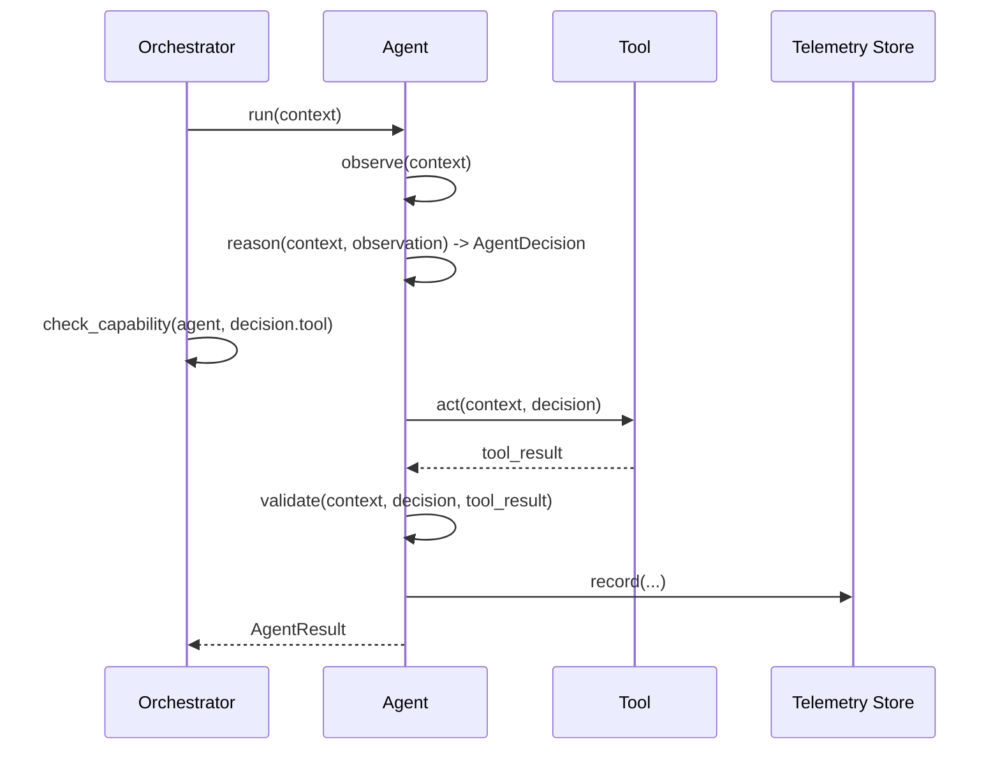

# Agent Model

Every agent in this repository inherits from `agents.base.BaseAgent` and
implements the same five-step lifecycle:

```
observe -> reason -> act -> validate -> record
```



## Core types (`agents/base.py`)

* **`AgentContext`** — everything an agent is allowed to observe: repository,
  PR number, commit SHA, changed files, diff, test results, coverage,
  security findings, and pipeline history. Agents cannot see anything not in
  this object.
* **`AgentDecision`** — the single decision an agent's `reason` step
  produces: `action`, `reason`, an optional `tool` + `arguments`, a
  `confidence` score, and `requires_approval`.
* **`AgentResult`** — the final outcome: `success`, a human-readable
  `message`, `artifacts` (including the raw decision), and
  `validation_results`.
* **`BaseAgent`** — the lifecycle runner. Subclasses only implement
  `observe`, `reason`, `act`, and `validate`; `record` and the overall `run`
  loop are shared.

## Specialized agents

| Agent | Purpose | Can modify code? | Can merge/deploy? |
|---|---|---|---|
| `test_quality_agent` | Reviews assertions, behavioral coverage, mocking, isolation, reliability, and missing tests; can generate & run candidate tests | Yes (requires approval) | No |
| `failure_analysis_agent` | Explains why CI failed and which files are likely at fault | No | No |
| `merge_conflict_agent` | Proposes and validates a merge-conflict resolution | Yes (requires approval) | No |
| `supply_chain_agent` | Summarizes dependency/action pinning and scanner findings | No | No |
| `pipeline_optimizer_agent` | Learns from pipeline history; recommends workflow changes | No (never modifies workflows) | No |

## Why "Capability != Authority"?

`policies/agent_permissions.yml` says what an agent is *capable* of
attempting (e.g. `test_quality_agent` may attempt `modify_code`).
`policies/approval_rules.yml` says which of those capabilities *require a
human* before they take effect. The orchestrator enforces both: an agent
whose decision references a tool outside its policy entry is rejected
outright (`PolicyViolation`), and any action under
`requires_human_approval` is surfaced as a recommendation, never applied
automatically.
