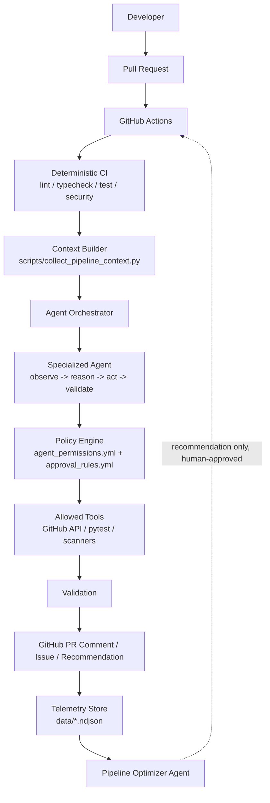

# Architecture

`evolutionary-cicd` keeps GitHub Actions as the single, authoritative
execution engine. Agents observe pipeline state and reason about it, but
every side effect flows through an explicit policy gate and a narrow set of
allowed tools.

## Layers

| Layer | Responsibility | Code |
|---|---|---|
| Deterministic CI | Build, lint, type-check, test, scan | `.github/workflows/ci.yml` |
| Context Builder | Turn a GitHub event + telemetry into an `AgentContext` | `scripts/collect_pipeline_context.py` |
| Orchestrator | Load policy, run one agent, enforce capability checks, post PR comments | `agents/orchestrator/orchestrator.py` |
| Agents | Domain-specific observe/reason/act/validate logic | `agents/*/agent.py` |
| Policy Engine | Declarative capability + approval rules | `policies/*.yml` |
| Tools | The only things an agent may actually invoke | `tools/*` |
| Telemetry | Auditable, append-only record of every agent execution | `telemetry/*`, `data/*.ndjson` |
| Pipeline Optimizer | Learns from telemetry, proposes workflow improvements | `agents/pipeline_optimizer/agent.py` |

## Why this shape?

* **GitHub Actions remains authoritative.** No agent runs outside of, or
  instead of, a workflow step. Agents are just another step.
* **Policy is data, not code.** `policies/agent_permissions.yml` and
  `policies/approval_rules.yml` are read at runtime; changing an agent's
  authority does not require changing Python code.
* **Deterministic tools stay deterministic.** Tests are run by pytest.
  Vulnerabilities are found by Bandit/pip-audit. The LLM is never asked to
  simulate any of these.
